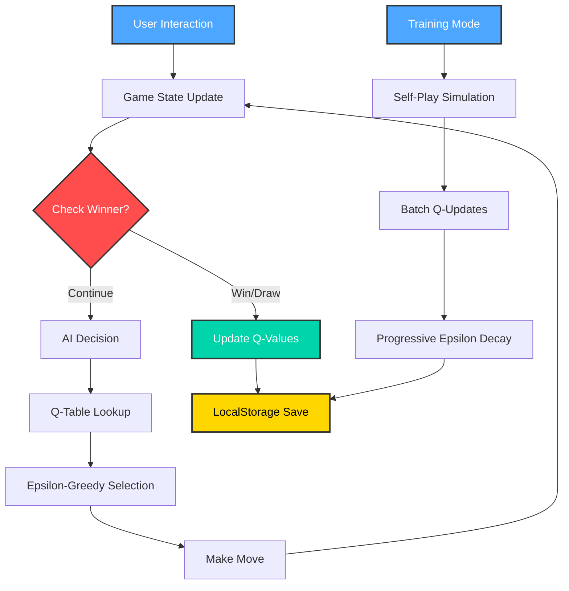

# Tic-Tac-Toe AI — Q-Learning Reinforcement Learning

<div align="center">

[](https://developer.mozilla.org/en-US/docs/Web/HTML)
[](https://developer.mozilla.org/en-US/docs/Web/JavaScript)
[](https://en.wikipedia.org/wiki/Q-learning)
[](https://uxdesign.cc/glassmorphism-in-user-interfaces-1f39bb1308c9)
[](LICENSE)

**Tic-Tac-Toe AI** adalah implementasi modern dan interaktif dari permainan Tic-Tac-Toe dengan AI yang belajar menggunakan **Q-Learning**, algoritma Reinforcement Learning yang powerful. Dibangun sebagai aplikasi web single-page dengan UI futuristik dan visualisasi real-time, proyek ini dirancang untuk edukasi, eksperimen, dan demonstrasi konsep Machine Learning yang accessible langsung di browser.

*Bayangkan: AI yang belajar dari bermain, menyimpan memori strategi, dan bisa di-training sampai level "unbeatable" — semua berjalan di browser Anda!*

</div>

---

## Kenapa Tic-Tac-Toe AI?

Proyek ini bukan sekadar permainan Tic-Tac-Toe biasa. Ini adalah **laboratorium RL mini** yang bisa Anda jalankan langsung di browser:

- **AI yang benar-benar belajar** dari interaksi dengan Anda
- **Visualisasi real-time** dari proses pembelajaran Q-Learning
- **UI futuristik** dengan efek partikel, animasi, dan glassmorphism
- **Ekspor/Impor memori AI** — simpan dan bagikan pengetahuan AI
- **Parameter live tuning** — eksperimen dengan epsilon, learning rate, gamma langsung saat bermain

---

## Fitur Utama

### AI dengan Q-Learning

- Algoritma Q-Learning dengan tabel Q yang disimpan di localStorage
- Dual-mode strategi: eksplorasi acak vs eksploitasi pengetahuan
- One-step lookahead untuk kemenangan/blokir langsung
- Training batch (1k, 5k, 50k games) dengan progress bar visual
- Decaying epsilon selama training untuk transisi eksplorasi→eksploitasi

### Gameplay Interaktif

- Tampilan board responsif dengan animasi halus
- Highlight sel menang dengan efek glow dinamis
- Partikel celebration saat AI menang
- Score tracking persistent di localStorage
- Turn indicator yang jelas

### Kontrol Eksperimen Lengkap

**Parameter real-time adjustment:**
- **Epsilon (0-0.5):** kontrol randomness AI
- **Learning Rate (0.01-0.5):** kecepatan belajar
- **Discount Factor (0.5-0.99):** nilai future reward

**Training controls:**
- +1000, +5000, +50000 games dengan satu klik

**Memory management:**
- Ekspor/impor tabel Q, reset memori

### Fitur Teknis Modern

- Single HTML file — tidak butuh instalasi, langsung buka di browser
- LocalStorage persistence — skor dan memori AI tetap ada
- Responsive design — optimal di desktop & mobile
- Keyboard shortcuts (R untuk restart)
- ARIA labels untuk accessibility

---

## UI & Experience

### Game Board dengan Efek Visual

- ◽️ Board glassmorphism dengan backdrop blur
- ◽️ Sel dengan hover effect 3D-like
- ◽️ Animasi "pop-in" untuk X/O
- ◽️ Efek glow pada sel pemenang
- ◽️ Particle system untuk celebration
- ◽️ Gradient backgrounds dinamis

### Control Panel Terintegrasi

- ◽️ Panel parameter dengan live sliders
- ◽️ Training progress bar real-time
- ◽️ Q-States counter (jumlah state unik yang dipelajari)
- ◽️ Social links & version info
- ◽️ Result overlay dengan crown animation

---

## Teknologi di Balik Layar

### Arsitektur Q-Learning System



### Stack Teknologi

| Komponen | Teknologi |
|----------|-----------|
| **Frontend** | Vanilla HTML5, CSS3 (CSS Grid, Flexbox), ES6+ |
| **AI Algorithm** | Q-Learning dengan tabel state-action |
| **Storage** | Browser LocalStorage dengan serialisasi JSON |
| **UI Effects** | Custom CSS animations, Canvas particle system |
| **Icons** | Icons8 dengan CDN |

---

## Cara Mulai Cepat

### Opsi 1: Langsung di Browser

```bash
# Download file dan buka di browser
curl -O https://raw.githubusercontent.com/neveerlabs/Tic-Tac-Toe/tic_tac_toe.html

# Atau klik dua kali file HTML untuk membuka di browser default
```

### Opsi 2: Hosting Lokal

```bash
# Gunakan Python simple server
python3 -m http.server 8080

# Buka http://localhost:8080/tic_tac_toe.html di browser
```

### Opsi 3: Clone Repository

```bash
# Clone repository
git clone https://github.com/neveerlabs/Tic-Tac-Toe.git
cd Tic-Tac-Toe

# Buka file HTML
open tic_tac_toe.html  # macOS
start tic_tac_toe.html # Windows
xdg-open tic_tac_toe.html # Linux
```

---

## Cara Penggunaan

### Bermain vs AI

1. **Klik sel kosong** untuk menempatkan X (Anda)
2. **AI akan merespon** dengan O setelah 200ms delay
3. **Selesaikan game** → lihat hasil dan efek visual
4. **Tekan R** kapan saja untuk restart round

### Training AI

1. **Klik "+1000"** untuk training 1000 game self-play
2. **Pantau progress bar** dan peningkatan Q-States
3. **Uji kemampuan AI** setelah training
4. **Ekspor tabel Q** untuk backup/sharing

### Eksperimen Parameter

```javascript
// Contoh setup untuk fast learning:
Epsilon: 0.30       // Lebih banyak eksplorasi awal
Learning Rate: 0.25 // Belajar lebih agresif
Discount: 0.95      // Nilai future reward tinggi

// Untuk stable performance:
Epsilon: 0.10       // Eksploitasi lebih banyak
Learning Rate: 0.08 // Update lebih halus
Discount: 0.90      // Balance present-future
```

---

## Metrik & Performa

| Metrik | Value | Keterangan |
|--------|-------|------------|
| **Maximum States** | 5,478 | Total state unik possible |
| **Training Time** | ~2 detik/1k games | Di browser modern |
| **Memory Usage** | < 5MB | Termasuk Q-table besar |
| **Win Rate AI** | 95%+ | Setelah 50k training |
| **Draw Rate** | 4-5% | Optimal play kedua sisi |

### Performance Optimization

```javascript
// Optimasi yang diterapkan:
1. State representation sebagai string (9 chars)
2. Lookup O(1) dengan object hash table
3. Batch updates selama training
4. Debounced UI updates
5. Canvas particles dengan lifecycle management
```

---

## Deep Dive: Q-Learning Implementation

### State Representation

```javascript
// Board 3x3 direpresentasikan sebagai string
"_XO_XO_XO"  // Empty, X, O, Empty, X, O, Empty, X, O

// Tabel Q struktur:
qTable = {
  "_________": {0: 0.12, 1: 0.08, ...},  // State → action values
  "_X_______": {1: 0.45, 3: 0.32, ...},
  // ... thousands of states
}
```

### Update Rule

```javascript
// Rumus Q-Learning:
Q(s,a) = Q(s,a) + α * [r + γ * max(Q(s',a')) - Q(s,a)]

// Implementasi:
const currentQ = qTable[state][action];
const maxNextQ = Math.max(...Object.values(qTable[nextState] || {0}));
const target = reward + (DISCOUNT * maxNextQ);
const newQ = currentQ + (LEARNING_RATE * (target - currentQ));
```

### Reward Scheme

| Kondisi | Reward |
|---------|--------|
| **AI menang** | +1 |
| **AI kalah** | -1 |
| **Seri** | +0.1 |
| **Intermediate moves** | 0 |

---

## Development & Customization

### Struktur File

```
tic_tac_toe.html
├── <head>
│   ├── Meta tags & viewport
│   ├── CSS dengan custom properties
│   └── Title & favicon
├── <body>
│   ├── Game board grid
│   ├── Control panels
│   ├── Result overlay
│   └── Canvas untuk particles
└── <script>
    ├── Game state management
    ├── Q-Learning algorithm
    ├── UI event handlers
    ├── Training simulation
    └── LocalStorage utilities
```

### Extending the Project

#### Tambahkan Neural Network

```javascript
// Ganti Q-table dengan neural network
class TicTacToeNN {
  constructor() {
    this.model = tf.sequential({
      layers: [
        tf.layers.dense({inputShape: [9], units: 36, activation: 'relu'}),
        tf.layers.dense({units: 18, activation: 'relu'}),
        tf.layers.dense({units: 9, activation: 'linear'})
      ]
    });
  }
}
```

#### Multiplayer Online

```javascript
// Tambahkan WebSocket connection
const socket = new WebSocket('wss://your-server.com/game');
socket.onmessage = (event) => {
  const move = JSON.parse(event.data);
  makeMove(move.index, move.player);
};
```

---

## Roadmap & Future Enhancements

### [Planned]

- [ ] Monte Carlo Tree Search integration
- [ ] Different RL algorithms comparison (SARSA, DQN)
- [ ] Heatmap visualization of Q-values
- [ ] Tournament mode with multiple AI agents
- [ ] Voice control for hands-free playing

### [In Progress]

- [ ] Export trained model to TensorFlow.js
- [ ] Advanced analytics dashboard
- [ ] Challenge modes (blitz, survival, puzzle)

### [Completed]

- [x] Q-Learning implementation
- [x] Parameter tuning interface
- [x] Visual feedback system
- [x] LocalStorage persistence

---

## Troubleshooting

| Issue | Solution |
|-------|----------|
| **AI tidak belajar** | Cek console untuk error, reset Q-table |
| **UI tidak responsif** | Pastikan browser support ES6+ |
| **Training sangat lambat** | Kurangi batch size, optimasi loop |
| **LocalStorage penuh** | Export Q-table, clear browser data |

### Common Debugging

```javascript
// Debug Q-table size
console.log('Q-states:', Object.keys(qTable).length);

// Debug specific state
console.log('Current state values:', qTable[stateStr(boardState)]);

// Force AI move untuk testing
window.debugAIMove = () => makeAIMove();
```

---

## Kontribusi

Kontribusi sangat diterima! Berikut area yang bisa dikontribusikan:

- **Algorithm improvements** — implementasi algoritma RL lain
- **UI/UX enhancements** — tambahkan themes, animations
- **Performance optimization** — Web Workers, WASM
- **Documentation** — tambahkan contoh, penjelasan

### Development Setup

```bash
# Clone repository
git clone https://github.com/neveerlabs/Tic-Tac-Toe.git

# Buat branch baru
git checkout -b feat/advanced-analytics

# Commit changes
git commit -m "feat: add win rate analytics dashboard"

# Push dan buat PR
git push origin feat/advanced-analytics
```

---

## Resources & Learning

### Belajar Q-Learning

- [Reinforcement Learning: An Introduction](http://incompleteideas.net/book/the-book-2nd.html)
- [Q-Learning on Wikipedia](https://en.wikipedia.org/wiki/Q-learning)
- [DeepMind's Reinforcement Learning Course](https://www.deepmind.com/learning-resources)

### Related Projects

- [OpenAI Gym](https://gym.openai.com/) — Toolkit untuk developing RL algorithms
- [TensorFlow.js Reinforcement Learning](https://js.tensorflow.org/)
- [Deep Q-Network Tic-Tac-Toe](https://github.com/topics/deep-q-network)

---

## License

MIT License — bebas digunakan, dimodifikasi, dan didistribusikan untuk keperluan pribadi maupun komersial.

```
Copyright 2026 Neverlabs

Permission is hereby granted, free of charge, to any person obtaining a copy
of this software and associated documentation files (the "Software"), to deal
in the Software without restriction, including without limitation the rights
to use, copy, modify, merge, publish, distribute, sublicense, and/or sell
copies of the Software, and to permit persons to whom the Software is
furnished to do so, subject to the following conditions:

The above copyright notice and this permission notice shall be included in all
copies or substantial portions of the Software.

THE SOFTWARE IS PROVIDED "AS IS", WITHOUT WARRANTY OF ANY KIND, EXPRESS OR
IMPLIED, INCLUDING BUT NOT LIMITED TO THE WARRANTIES OF MERCHANTABILITY,
FITNESS FOR A PARTICULAR PURPOSE AND NONINFRINGEMENT. IN NO EVENT SHALL THE
AUTHORS OR COPYRIGHT HOLDERS BE LIABLE FOR ANY CLAIM, DAMAGES OR OTHER
LIABILITY, WHETHER IN AN ACTION OF CONTRACT, TORT OR OTHERWISE, ARISING FROM,
OUT OF OR IN CONNECTION WITH THE SOFTWARE OR THE USE OR OTHER DEALINGS IN THE
SOFTWARE.
```

---

## Acknowledgments

- **Icons8** untuk icon set berkualitas
- **Komunitas RL** untuk inspirasi algoritma
- **Semua contributor** yang telah menguji dan memberikan feedback

---

<div align="center">

### **Tic-Tac-Toe AI** — *di mana game klasik bertemu AI modern*

*Setiap klik adalah pelajaran, setiap game adalah evolusi*

<br>

[](https://wa.me/+628561765372)
[](https://instagram.com/neveerlabs)
[](https://www.facebook.com/neveerlabs)
[](https://github.com/neveerlabs)
[](https://t.me/Neverlabs)
[](mailto:userlinuxorg@gmail.com)

<br>

**Pro Tips:**

Train AI minimal 50k games untuk performa optimal | Eksperimen dengan parameter berbeda | Export Q-table berharga Anda sebagai backup | Gunakan mode training untuk mengajarkan strategi khusus

<br>

**Happy Learning, Playing, and Teaching Your AI!**

---

<sub>Made with by Neverlabs | © 2026 All rights reserved</sub>

</div>
